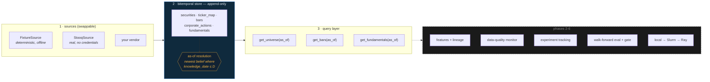

# research-platform

A point-in-time research platform — the infrastructure quantitative researchers
work *inside*. Not a trading strategy.

**Phase 1 of 6 is complete: the point-in-time data layer.** It is public now
because the interesting design decisions are already in it, and because a repo
that appears finished on day one is a repo nobody watched being built.



---

## What problem this solves

You are testing a signal. It works. You put it into production and it does not.

Nothing was wrong with your model. The problem is that the database you
researched against is a **current-state** database, and it quietly told you
things you could not have known at the time:

- The revenue figure you used for Q2 was **restated in November**. Your backtest
  read the corrected number in August, because that is the only number the
  database still holds.
- Your universe came from today's security master, so it contains **only the
  companies that survived**. Every firm that went bankrupt in your sample is
  missing, and your strategy looks like it avoids bankruptcies.
- Your prices are **adjusted for splits that had not happened yet**. A 2019
  close downloaded today has been divided by a factor nobody could have applied
  in 2019.
- The ticker `ZZZ` in your series is **two different companies** spliced at the
  seam where one delisted and another took the symbol.

None of these throw an error. They all produce a clean, plausible, well-behaved
series and a Sharpe ratio that does not survive contact with reality.

This layer makes that class of bug **structurally impossible rather than
carefully avoided**. Every record carries the date it became *knowable*,
separately from the date it *describes*, nothing is ever overwritten, and every
query takes an as-of date.

```python
from datetime import date
from rplat import Store, get_universe, get_fundamentals

with Store.open("data/research.duckdb") as store:
    # exactly what a researcher could have known that morning
    universe = get_universe(store, date(2022, 9, 1))
    eps = get_fundamentals(store, date(2022, 9, 1), metrics=["eps_diluted"])
```

Change the as-of date and every number changes with it. That is the whole idea.

## See it

```bash
make demo
```

Under a minute, no network, no credentials, no cluster. It builds the store from
a deterministic fixture and walks five traps, showing the same query returning
different — and correct — answers on different as-of dates:

```
── 3. Restatement ─────────────────────────────────────────────
  Ardent files Q2-2022 diluted EPS on 2022-08-01, then restates it on 2022-11-15.

  as of 2022-09-01: eps_diluted = 1.5
  as of 2022-12-01: eps_diluted = 1.2

  Today's database shows only 1.20. A backtest run in September traded on 1.50.
```

## The two dates

Every fact carries both, and keeping them apart is the entire mechanism:

| | meaning | example |
|---|---|---|
| `effective_date` | the date the fact is **about** | the session a bar covers; the quarter a filing reports |
| `knowledge_date` | the date it first became **knowable** | the filing date, weeks after the quarter ends; a split's announcement, not its ex-date |

A restatement is a **new row** with the same `effective_date` and a later
`knowledge_date`. Both survive. "What did we believe on date D" becomes a query
rather than an archaeology project — and the audit trail is free:

```bash
rplat history --security SEC0001 --period-end 2022-06-30 --metric eps_diluted
```
```
knowledge_date  value
    2022-08-01    1.5
    2022-11-15    1.2
```

Full reasoning, including what breaks without this, is in
**[docs/point-in-time.md](docs/point-in-time.md)**.

## What's in Phase 1

| Component | What it does |
|---|---|
| `rplat.store.Store` | Append-only bitemporal store on DuckDB. No update path, by design. |
| `rplat.sources.DataSource` | The vendor seam. Sources implement only the datasets they actually have. |
| `FixtureSource` | Deterministic synthetic vendor that ships the traps on purpose — restatements, delistings, a recycled ticker, a split, a late backfill. |
| `StooqSource` | Real free data, no API key, with its limitations documented rather than hidden. |
| `get_universe(as_of)` | Survivorship-safe universe, including names that later died. |
| `get_bars(as_of)` | Raw prices, split-adjusted using only actions announced by the as-of date. |
| `get_fundamentals(as_of)` | The belief held on that date, not today's corrected value. |

### Why the reference data is synthetic

Free price feeds hand you a clean adjusted series with no restatement history —
so the failures this platform exists to prevent are *invisible* in them. You
cannot demonstrate that you handle a restatement correctly using data that has
never been restated. The fixture is generated from a fixed seed and contains, by
construction, one of each failure mode. `StooqSource` exists alongside it to
prove the source interface is a real seam.

## Install

```bash
python -m venv .venv && source .venv/bin/activate
pip install -e ".[dev]"
```

```bash
make demo        # the walkthrough above
make test        # pytest
make check       # ruff + mypy --strict + pytest
```

## CLI

```bash
rplat ingest --db data/research.duckdb
rplat universe --as-of 2022-06-30
rplat universe --as-of 2023-06-30            # two names gone, one arrived
rplat bars --as-of 2022-08-20 --security SEC0002 --start 2022-08-01 --end 2022-08-01
rplat bars --as-of 2023-01-03 --security SEC0002 --start 2022-08-01 --end 2022-08-01
rplat history --security SEC0001 --period-end 2022-06-30
```

## Roadmap

| Phase | Scope | Status |
|---|---|---|
| **1** | **Point-in-time data layer** | **done** |
| 2 | Feature pipeline with lineage — declarative definitions, dependency DAG, content-hashed transforms | next |
| 3 | Data-quality monitor — leakage detection, survivorship, staleness, PSI drift, coverage; Prometheus metrics | |
| 4 | Experiment tracking — run id, git SHA, config + dataset hash, reproduce-a-run | |
| 5 | Evaluation harness — walk-forward CV with embargo, CIs not point estimates, multiple-testing awareness, promotion gate | |
| 6 | Scale-out — one interface over local, Slurm array, and Ray backends | |

Phase 3 is the one that matters most: a leakage detector is only meaningful if
the data layer can say what was knowable when. That is what Phase 1 buys.

## Design notes

- **Python 3.11+, `mypy --strict`, `ruff`, `pytest`**, CI on every push.
- **Raw prices only.** Adjusted-close columns are a look-ahead trap; adjustment
  is computed at query time from actions knowable then.
- **Identity is `security_id`, never a ticker.** Symbols are recycled between
  unrelated companies and are resolved per as-of date.
- **Append-only is enforced by the writer**, not the database — DuckDB has no
  such mode. The store exposes no update or delete path, and a test asserts that
  re-ingesting a changed value adds a row rather than replacing one.

## License

MIT
