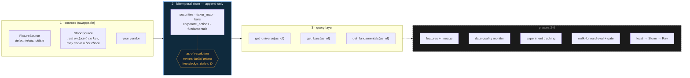

# research-platform

A point-in-time research platform — the infrastructure quantitative researchers
work *inside*. Not a trading strategy.

**Phase 1 of 6 is complete: the point-in-time data layer.** It is public now
because the interesting design decisions are already in it, and because a repo
that appears finished on day one is a repo nobody watched being built.



---

## What problem this solves

You are testing a signal. It works. You put it into production and it does not.

Nothing was wrong with your model. The problem is that the database you
researched against is a **current-state** database, and it quietly told you
things you could not have known at the time:

- The revenue figure you used for Q2 was **restated in November**. Your backtest
  read the corrected number in August, because that is the only number the
  database still holds.
- Your universe came from today's security master, so it contains **only the
  companies that survived**. Every firm that went bankrupt in your sample is
  missing, and your strategy looks like it avoids bankruptcies.
- Your prices are **adjusted for splits that had not happened yet**. A 2019
  close downloaded today has been divided by a factor nobody could have applied
  in 2019.
- The ticker `ZZZ` in your series is **two different companies** spliced at the
  seam where one delisted and another took the symbol.

None of these throw an error. They all produce a clean, plausible, well-behaved
series and a Sharpe ratio that does not survive contact with reality.

This layer makes that class of bug **structurally impossible rather than
carefully avoided**. Every record carries the date it became *knowable*,
separately from the date it *describes*, nothing is ever overwritten, and every
query takes an as-of date.

```python
from datetime import date
from rplat import Store, get_universe, get_fundamentals

with Store.open("data/research.duckdb", read_only=True) as store:
    # everything knowable by the END of 2022-09-01, New York time
    universe = get_universe(store, date(2022, 9, 1))
    eps = get_fundamentals(store, date(2022, 9, 1), metrics=["eps_diluted"])
```

Change the as-of date and every number changes with it. That is the whole idea.

"Structurally impossible" has one precondition, stated where it matters: every
source must stamp `knowledge_date` honestly. The store rejects stamps that are
*impossible* (a bar known before its session, a quarter filed before it ended)
but cannot detect ones that are merely wrong. See
[the assumption this cannot check for you](docs/point-in-time.md#the-assumption-this-cannot-check-for-you).

## See it

```bash
make demo
```

Under a minute, no network, no credentials, no cluster. It builds the store from
a deterministic fixture and walks five traps, showing the same query returning
different — and correct — answers on different as-of dates:

```
── 3. Restatement ─────────────────────────────────────────────
  Ardent files Q2-2022 diluted EPS on 2022-08-01, then restates it on 2022-11-15.

  as of 2022-09-01: eps_diluted = 1.5
  as of 2022-12-01: eps_diluted = 1.2

  Today's database shows only 1.20. A backtest run in September traded on 1.50.
```

## The two dates

Every fact carries both, and keeping them apart is the entire mechanism:

| | meaning | example |
|---|---|---|
| `effective_date` | the date the fact is **about** | the session a bar covers; the quarter a filing reports |
| `knowledge_date` | the date it first became **knowable** | the filing date, weeks after the quarter ends; a split's announcement, not its ex-date |

A restatement is a **new row** with the same `effective_date` and a later
`knowledge_date`. Both survive. "What did we believe on date D" becomes a query
rather than an archaeology project — and the audit trail is free:

```bash
rplat history --security SEC0001 --period-end 2022-06-30 --metric eps_diluted
```
```
knowledge_date  value
    2022-08-01    1.5
    2022-11-15    1.2
```

Full reasoning, including what breaks without this, is in
**[docs/point-in-time.md](docs/point-in-time.md)**.

## As-of semantics, to the time of day

A stamp is a calendar date with no time of day, so "as of D" needs one exact
meaning. It has this one ([full contract](docs/point-in-time.md#as-of-semantics),
[`rplat/clock.py`](src/rplat/clock.py)):

| | rule |
|---|---|
| time zone | knowledge and as-of dates are calendar dates in **America/New_York** |
| `as_of = D` | the view at the **end of day D**: `knowledge_date <= D` included, `D + 1` excluded |
| input type | a `datetime.date` only. A `datetime` or `pandas.Timestamp` raises `TypeError` |
| `start` / `end` | inclusive at both ends |
| `delisting_date`, ticker `end_date` | exclusive: the first date the name or symbol no longer applies |

A fact stamped D may land late on D: SEC filings started up to 5:30 p.m. ET
(10 p.m. for Forms 3/4/5, 144, 13D/G) take that day's date,
[17 CFR 232.13(a)](https://www.law.cornell.edu/cfr/text/17/232.13). So a
decision made *during* D must not query as of D. Convert the real instant:

```python
from datetime import datetime
from zoneinfo import ZoneInfo
from rplat import as_of_for_decision

as_of_for_decision(datetime(2022, 8, 1, 9, 30, tzinfo=ZoneInfo("America/New_York")))
# -> date(2022, 7, 31): today's stamps are never safe by default
```

Pass `day_complete_at=time(...)` only if you can defend when your sources
finish publishing for the day. DuckDB's session time zone is pinned to UTC, so
no result depends on the machine's zone. A test compares two processes, one
under `TZ=America/New_York` and one under `TZ=Asia/Tokyo`.

## What's in Phase 1

| Component | What it does |
|---|---|
| `rplat.store.Store` | Append-only bitemporal store on DuckDB. The API has no update or delete; `Store.sql` runs one `SELECT` only; ingests are atomic. The file itself can still be edited with other tools. Opens `read_only=True` for many concurrent readers. |
| append-time validation | Rejects impossible records before they land: stamps earlier than the fact, `high < low`, splits without a positive ratio. |
| `rplat.sources.DataSource` | The vendor seam. Sources implement only the datasets they actually have. |
| `FixtureSource` | Deterministic synthetic vendor that ships the traps on purpose — restatements, delistings, a recycled ticker, a split, a late backfill. |
| `StooqSource` | A real free endpoint with no API key and its limitations documented. During the 2026-09 audit, one request from one machine got a JavaScript bot-check page instead of CSV; that has not been re-checked since. The source now reports that case by name. It is tested offline against a hand-written CSV in Stooq's column layout (Date,Open,High,Low,Close,Volume); the parser has not been run against a live Stooq response since the audit. |
| `get_universe(as_of)` | Survivorship-safe universe, including names that later died. |
| `get_bars(as_of)` | Raw prices, split-adjusted for splits both announced and effective by the as-of date. |
| `get_fundamentals(as_of)` | The belief held on that date, not today's corrected value. |
| `as_of_for_decision(t)` | A timezone-aware decision instant turned into a leak-free as-of date. |

### Why the reference data is synthetic

Free price feeds hand you a clean adjusted series with no restatement history —
so the failures this platform exists to prevent are *invisible* in them. You
cannot demonstrate that you handle a restatement correctly using data that has
never been restated. The fixture is generated from a fixed seed and contains, by
construction, one of each failure mode. `StooqSource` exists alongside it to
prove the source interface is a real seam.

"Fixed seed" means the same records in every process, whatever
`PYTHONHASHSEED` is, and a test checks that with SHA-256 digests. It does not
mean the same across NumPy versions: NumPy's
[NEP 19](https://numpy.org/neps/nep-0019-rng-policy.html) lets distribution
methods change their streams in feature releases. The traps are constants and
do not depend on the RNG.

## Install

Needs Python 3.11 or newer.

```bash
python3.12 -m venv .venv && source .venv/bin/activate
pip install -e ".[dev]"
```

```bash
make demo        # the walkthrough above
make test        # pytest
make check       # ruff + mypy --strict + pytest
make bench       # the two benchmarks below
```

`make` uses [uv](https://docs.astral.sh/uv/) when it is on your `PATH`.
Otherwise it uses `PY` (default `python3`) and stops with a clear message if
that interpreter is older than 3.11: run `make PY=python3.12 demo`.

## CLI

```bash
rplat ingest --db data/research.duckdb
rplat universe --as-of 2022-06-30
rplat universe --as-of 2023-06-30            # Northwind gone, Zenith (new ZZZ) arrived
rplat bars --as-of 2022-08-20 --security SEC0002 --start 2022-08-01 --end 2022-08-01
rplat bars --as-of 2023-01-03 --security SEC0002 --start 2022-08-01 --end 2022-08-01
rplat history --security SEC0001 --period-end 2022-06-30
```

The query commands open the store read-only and refuse a path that does not
exist, instead of creating an empty store and reporting zero rows.

`rplat ingest` loads the synthetic fixture and nothing else. `--force`
therefore rebuilds a fixture store; on a store holding other data it replaces
that data with the fixture, so it is not an upgrade path. It builds the new
store beside the old one and swaps it in only after the ingest has succeeded.
It refuses to replace a file whose tables are not exactly an rplat store's, or
one another process has open, and it refuses to build at all while a DuckDB
write-ahead log (`<db>.wal`) sits beside the target, because DuckDB would
replay that log into the new store.

## Measured

Every number here came from `bench/ingest.py` and `bench/asof.py`, run with
their default arguments (what `make bench` runs) unless another command is
stated, on 2026-09-26 on one machine: Python 3.12.13, DuckDB 1.5.5, pandas
3.0.6, Darwin 24.6.0 arm64 with 10 logical CPUs, in-memory stores.
"Before" is the same script run against commit `396572a`, the code before the
2026-09 audit fixes, in the same venv with `PYTHONPATH` pointing at that
commit's `src`. The machine was not idle: other jobs kept the one-minute load
average between 3.8 and 6.3. So before and after runs were interleaved in
pairs, alternating which went first. Each cell is the range of the
per-invocation medians (each script repeats its measurement 3 times and prints
the median). Treat them as orders of magnitude, not a benchmark suite.

| | before | after |
|---|---|---|
| `Store.append`, 100,000 bars (3 invocations each) | 5,764–7,115 rows/s | 335,183–363,433 rows/s |
| `get_bars`, one session × 2,000 names, 5,000,000-row table (6 each) | 0.671–0.839 s | 0.004–0.005 s |
| `store.as_of(BARS, d)`, full view of 2,502,000 rows (6 each) | 0.656–0.773 s | 0.710–0.919 s |

The append gain comes from building Arrow columns and inserting them in one
statement instead of `executemany`. The `get_bars` gain comes from pushing the
session range into SQL ahead of the as-of window. Resolving the *full* view
got slower: the after run was slower in all six pairs, by 1% to 19%. That is
probably the cost of the tie-break columns (`ingest_seq`, `row_ordinal`) in the
window's ordering and in every returned row, plus `ingested_at` now being
`TIMESTAMPTZ`; it has not been profiled. With every bar restated twice
(`bench/asof.py --rows 2000000 --revisions 3`, 6,000,000 stored rows, two
invocations, after only) the one-session query took 0.005–0.006 s and the full
1,002,000-row view 0.555–0.558 s.

## Roadmap

| Phase | Scope | Status |
|---|---|---|
| **1** | **Point-in-time data layer** | **done** |
| 2 | Feature pipeline with lineage — declarative definitions, dependency DAG, content-hashed transforms | next |
| 3 | Data-quality monitor — leakage detection, survivorship, staleness, PSI drift, coverage; Prometheus metrics | |
| 4 | Experiment tracking — run id, git SHA, config + dataset hash, reproduce-a-run | |
| 5 | Evaluation harness — walk-forward CV with embargo, CIs not point estimates, multiple-testing awareness, promotion gate | |
| 6 | Scale-out — one interface over local, Slurm array, and Ray backends | |

Phase 3 is the one that matters most: a leakage detector is only meaningful if
the data layer can say what was knowable when. That is what Phase 1 buys. The
append-time check for impossible stamps is the only leakage detection that
exists today.

Phase 6 has one piece of groundwork and nothing more. `Store.open(path,
read_only=True)` lets many processes read one store, following DuckDB's rule
that several processes may read a file only in read-only mode
([docs](https://duckdb.org/docs/current/connect/concurrency.html)). A test
holds eight reader processes open at once. There is no Slurm, Ray or cluster
code yet, and no run on any cluster has happened.

## Design notes

- **Python 3.11+, `mypy --strict`, `ruff`, `pytest`**, CI on every push to
  `main` and every pull request: 3.11–3.13, a job pinned to the lowest declared
  dependency versions, a coverage gate, and a job that builds the wheel and runs
  the demo from it.
- **Raw prices only.** Adjusted-close columns are a look-ahead trap; adjustment
  is computed at query time from actions knowable then.
- **Identity is `security_id`, never a ticker.** Symbols are recycled between
  unrelated companies and are resolved per as-of date.
- **Append-only is enforced by the writer**, not the database — DuckDB has no
  such mode. The store's API exposes no update or delete path, `Store.sql`
  refuses anything but a single `SELECT`, and a test asserts that re-ingesting
  a changed value adds a row rather than replacing one. Anyone who opens the
  file with the `duckdb` CLI can still change it.
- **Ties resolve by order, not by clock.** Two beliefs with the same fact key
  and `knowledge_date` resolve to the later append, then the later record in
  the batch. `ingested_at` (UTC) is provenance only.

## License

MIT
